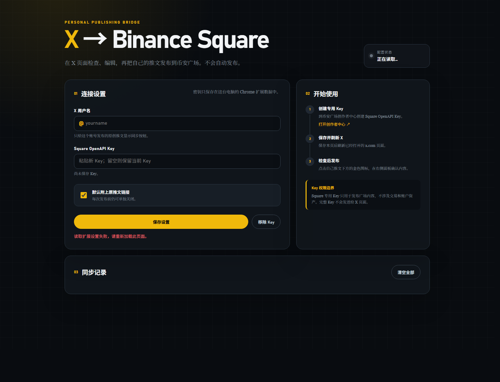

# X → Binance Square

[中文](README.zh-CN.md) | **English**

> **Disclaimer**: This is a community project, **not affiliated with, endorsed by, or sponsored by X (Twitter) or Binance**. Publishing is done with your own Binance Square OpenAPI key; you are responsible for the content you publish and for complying with both platforms' rules.

A personal-use Chrome extension (Manifest V3) that bridges **your own** X posts to [Binance Square](https://www.binance.com/square/creator-center/home). It adds a gold sync button under your original tweets, opens a review panel where you can edit the text and pick images, and publishes **only after you click confirm** — nothing is ever automatic.



## Privacy & security

- **No server, no telemetry.** The extension talks directly to Binance's official OpenAPI from your browser. There is no third-party backend, no analytics, and nothing leaves your machine except the publish request itself.
- **Key stays local.** Your Square OpenAPI key is stored in `chrome.storage.local` restricted to trusted extension contexts. Content scripts on x.com can never read it, and it is never logged.
- **Least privilege.** Host permissions are limited to `x.com` (parse your tweets), `www.binance.com` (Square OpenAPI), `pbs.twimg.com` (download your images) and `*.amazonaws.com` (upload to Binance's presigned S3 URLs).
- **Your account only.** The sync button appears only on original posts by the handle you configure — never on other people's tweets or reposts.
- **Publishing scope only.** A Square creator key cannot touch trading or funds.

## Features

- Review-before-publish panel: edit text, toggle the source-link footer, select up to 4 images.
- Handles X's lazy media rendering and "Show more" text truncation: the panel re-parses the tweet live when you click sync, so long posts and images are captured in full.
- Duplicate protection via local sync records; uncertain results (504 / mid-submit network loss) are marked **"needs confirmation"** and require an explicit, token-confirmed retry instead of silently re-publishing.
- Built-in **network diagnostics** on the options page to pinpoint VPN/split-proxy problems on the Binance API path.
- Plain ES modules, zero dependencies, zero build step.

## Install

1. Clone or download this repository.
2. Open `chrome://extensions` and enable **Developer mode**.
3. Click **Load unpacked** and select the repository root (the folder containing `manifest.json`).
4. The options page opens automatically; the toolbar icon reopens it later.

## Setup

1. Create a dedicated **Square OpenAPI key** in the [Binance Square Creator Center](https://www.binance.com/square/creator-center/home). It only allows publishing Square content — no trading, no assets.
2. In the options page, enter your X username (without `@`) and paste the key.
3. Refresh any open `x.com` tabs.
4. (Recommended) Run **Network diagnostics** on the options page once to verify the extension can reach the Binance API — especially if you use a VPN with split/PAC routing.

## Usage

Find one of your own posts → click the gold icon → review the panel (text, source link, images) → click **Publish to Binance Square**. On success the panel links straight to the Square post, and the tweet stays marked as synced.

## Limitations

- No video/GIF, no scheduled or automatic posting, no editing/deleting Square posts, no X Articles (long-form) — text and up to 4 static images only.
- Depends on X's DOM structure (`data-testid` attributes); a redesign may require updating `content/tweet-parser.js`.
- Binance's current public defaults are 100 successful posts and 400 media uploads per day — respect them and the Square content rules.

## Troubleshooting

- **No gold icon** — check the configured username, then refresh x.com; other users' posts and reposts never show it.
- **Key invalid / expired** — regenerate it in the Creator Center and update the options page.
- **"Needs confirmation"** — check your Square profile first; the extension deliberately does not auto-retry, to avoid double posting.
- **Web pages load but publishing fails** — run the built-in network diagnostics; it separates proxy split-routing issues from Binance-side blocking.

## Development

No dependencies to install:

```sh
node --test        # unit tests (never call the real Binance API)
npm run check      # syntax-checks all sources + manifest
```

## License

MIT — see [LICENSE](LICENSE).
